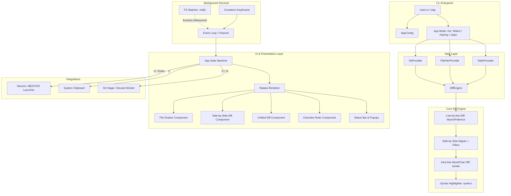

# Arquitetura Técnica — CLI Diff Viewer (`diffv`)

## 1. Visão Geral da Stack

A ferramenta foi definida para ser desenvolvida em **Rust**, visando:
- **Startup time instantâneo (< 8ms)**: ideal para acionamento frequente via popup flutuante do tmux (`tmux display-popup`).
- **Renderização por Célula (Double Buffering)**: performance máxima e zero flickering através do `ratatui` + `crossterm`.
- **Baixo consumo de recursos em background**: footprint de memória ~10-15MB e 0% de CPU no modo contínuo de observação (`--watch`).
- **Diffing de precisão**: utilização do algoritmo Myers/Patience com intra-line char diffing de alta performance via crate `similar`.

---

## 2. Dependências e Crates Selecionadas

| Crate | Versão Recomendada | Finalidade | Justificativa |
|---|---|---|---|
| **`ratatui`** | `^0.29` | Framework de Terminal UI (TUI) | Padrão da indústria em Rust; suporte a layouts avançados, widgets customizados e double buffering. |
| **`crossterm`** | `^0.28` | Backend de terminal e eventos | Manipulação de terminal multiplataforma, modo raw, suporte a TrueColor (24-bit) e Kitty keyboard protocol. |
| **`similar`** | `^2.6` | Algoritmos de Diffing | Implementação pura Rust de Myers, Patience e Levenshtein diffing em linhas, palavras e caracteres. |
| **`notify`** + **`notify-debouncer-mini`** | `^6.1` / `^0.4` | File System Watcher | Monitoramento assíncrono de modificações em disco com janela de debounce (~150ms). |
| **`syntect`** | `^5.2` | Syntax Highlighting | Realce de código com temas Sublime/VS Code integrados e suporte a centenas de linguagens. |
| **`clap`** | `^4.5` (derive) | CLI Argument Parsing | Parsing de flags, subcomandos e argumentos com geração automática de help e validação de tipos. |
| **`git2`** ou **`std::process::Command`** (git CLI) | `^0.19` ou CLI wrapper | Provedor de dados Git | Leitura de repositório, branches, working tree status, hunks e staging. |
| **`arboard`** | `^3.4` | Integração com Clipboard | Cópia de hunks/patches diretamente para a área de transferência do SO (macOS/Linux). |
| **`serde`** + **`toml`** | `^1.0` / `^0.8` | Configuração persistente | Leitura e validação do arquivo `~/.config/diffv/config.toml`. |

---

## 3. Diagrama Geral de Arquitetura



---

## 4. Pipeline de Processamento de Diff

A experiência idêntica ao VS Code depende de quatro passos sequenciais no processamento dos arquivos:

### 4.1 Passo 1: Myers / Patience Diff em Linhas
1. Compara a versão **Old** (HEAD ou arquivo original) contra a versão **New** (Working directory ou arquivo modificado).
2. Agrupa alterações em **Hunks**, contendo contexto e números de linha de origem e destino (`old_start`, `old_count`, `new_start`, `new_count`).

### 4.2 Passo 2: Alinhamento Dual-Column (Side-by-Side Aligner)
Para que as colunas da esquerda e da direita fiquem alinhadas horizontalmente:
- Se $N$ linhas foram adicionadas na direita sem remoção correspondente na esquerda, são inseridas $N$ **linhas virtuais (fillers/padding)** na coluna da esquerda.
- Se $M$ linhas foram removidas da esquerda sem adição correspondente na direita, são inseridas $M$ **linhas virtuais** na coluna da direita.
- Se linhas foram alteradas (substituições consecutivas de remoção e adição), elas são emparelhadas linha a linha até o limite do bloco.

### 4.3 Passo 3: Intra-line Character / Word Highlighting
Quando um par de linhas é identificado como uma modificação:
- A engine executa um diff fino (token-level ou char-level) utilizando a crate `similar::capture_diff_slices`.
- A linha recebe uma cor de fundo sutil (ex: vermelho escuro para deleção, verde escuro para adição).
- Os trechos específicos de palavras ou caracteres alterados recebem um realce mais forte com alto contraste (fundo mais claro ou texto brilhante), reproduzindo exatamente o comportamento do VS Code.

### 4.4 Passo 4: Syntax Highlighting com Fallback Gracioso
- As linhas de código recebem estilização sintática prévia via `syntect`.
- As cores de diff (adicionado, removido, intra-line) são mescladas preservando a legibilidade da sintaxe.

---

## 5. Estrutura de Módulos do Código

```
cli-diffviewer/
├── Cargo.toml
├── docs/
│   ├── spec.md                 # Especificação funcional completa
│   ├── roadmap.md              # Checklists de entrega
│   └── architecture.md         # Arquitetura técnica (este documento)
└── src/
    ├── main.rs                 # Inicialização da CLI, crossterm raw mode e panic hook
    ├── cli.rs                  # Estruturas do Clap (argumentos e flags)
    ├── config.rs               # Modelo de configuração TOML e defaults
    │
    ├── core/                   # Regras de negócio e processamento de diff
    │   ├── mod.rs
    │   ├── engine.rs           # Coordenação do pipeline de diff
    │   ├── aligner.rs          # Algoritmo de alinhamento side-by-side e fillers
    │   ├── intraline.rs        # Algoritmo de destaque intra-linha (similar)
    │   ├── models.rs           # Structs: FileDiff, Hunk, AlignedRow, DiffKind
    │   └── syntax.rs           # Wrapper syntect e cache de temas
    │
    ├── git/                    # Integração com o repositório
    │   ├── mod.rs
    │   ├── provider.rs         # Descoberta de arquivos modificados e status
    │   ├── patch.rs            # Extração de hunks e estatísticas (+X, -Y)
    │   └── actions.rs          # Execução de stage, unstage e discard de hunks
    │
    ├── watcher/                # Monitoramento de arquivos (AI Companion)
    │   ├── mod.rs
    │   └── service.rs          # Debounced notify watcher rodando em background thread
    │
    ├── ui/                     # Apresentação e Terminal UI (Ratatui)
    │   ├── mod.rs
    │   ├── app.rs              # App State Machine, navegação e foco
    │   ├── theme.rs            # Definições de estilos e cores (Tokyo Night, VS Code Dark+)
    │   └── components/
    │       ├── header.rs       # Cabeçalho com branch, totais e status
    │       ├── file_tree.rs    # Drawer lateral com lista de arquivos
    │       ├── side_by_side.rs # Renderizador das duas colunas de diff
    │       ├── unified.rs      # Renderizador unified/inline diff
    │       ├── ruler.rs        # Minimap vertical de hunks
    │       ├── status_bar.rs   # Barra de atalhos e alertas
    │       └── help_popup.rs   # Modal de ajuda de teclas (?)
    │
    └── integration/            # Comunicação externa
        ├── mod.rs
        ├── editor.rs           # Invocação do Neovim (nvim +line file / nvr)
        ├── clipboard.rs        # Cópia de hunks/patches para o clipboard
        └── tmux.rs             # Utilitários de detecção e redimensionamento do Tmux
```

---

## 6. Ciclo de Vida da Aplicação e Loop de Eventos

A aplicação adota um modelo clássico de **Event Loop Reativo**:

```
                  ┌──────────────────────┐
                  │ Terminal Events      │ (Key, Resize, Mouse)
                  └──────────┬───────────┘
                             │
                             ▼
┌──────────────────┐    ┌─────────┐     ┌──────────────────────┐
│ File Watcher     │--->│ mpsc    │---->│ App::update(event)   │
│ Background Thread│    │ Channel │     └──────────┬───────────┘
└──────────────────┘    └─────────┘                │
                                                   ▼
                                        ┌──────────────────────┐
                                        │ Ratatui::draw(&app)  │
                                        └──────────────────────┘
```

1. **Canal Central MPSC**:
   - Um canal `tokio::sync::mpsc` ou `std::sync::mpsc` unifica eventos do usuário (teclado, resize) e eventos de background (arquivos gravados pelo agente de IA no disco).
2. **Panic Hook Seguro**:
   - Uma closure no `std::panic::set_hook` garante que o modo raw do terminal seja desabilitado e a tela do terminal seja restaurada caso ocorra algum panic inesperado, evitando deixar o terminal em estado corrompido.
3. **Estado Preservado no Reload**:
   - Quando o watcher dispara um evento de reload, o `App` recalcula o diff do arquivo atual mantendo o índice do hunk focado e a porcentagem relativa de scroll.

---

## 7. Integração Tmux e Neovim

### 7.1 Tmux Floating Popup
A ferramenta é compilada para um binário autônomo `diffv`. Para integrá-la ao tmux como um popup instantâneo:
```tmux
# ~/.tmux.conf
# Abre o diffviewer em um popup centralizado de 90% da tela em modo watch
bind-key d display-popup -d "#{pane_current_path}" -w 92% -h 90% -E "diffv --watch"
```

### 7.2 Neovim Remote Jump
Ao pressionar `e` em uma linha da diff:
1. Verifica se `nvr` (neovim-remote) está instalado e se existe um socket Neovim no ambiente (`$NVIM`).
2. Se sim, instrui o Neovim existente a abrir o arquivo na linha correta sem fechar a sessão.
3. Se não, suspende temporariamente a TUI do `diffv` e invoca `$EDITOR +<line> <file>`. Ao fechar o editor, o `diffv` restaura a visualização instantaneamente.

### 7.3 Busca com `fzf` (opcional) e Picker Interno
`Ctrl+p` / `Ctrl+f` geram a lista de candidatos (`App::prepare_fzf`) e o resultado escolhido volta por `handle_fzf_file_result` / `handle_fzf_text_result`:
1. Se o `fzf` estiver no `PATH` (`is_fzf_available`), a TUI é suspensa e o `fzf` roda em tela cheia com os candidatos.
2. Se não, abre o picker interno (`ui/components/picker.rs`): popup com filtro fuzzy/substring (smart-case, termos separados por espaço, em `Ctrl+f` só o conteúdo da linha é comparado, como o `--nth=2` do fzf). O item escolhido entra pelos mesmos handlers, então o comportamento após a escolha é idêntico.
