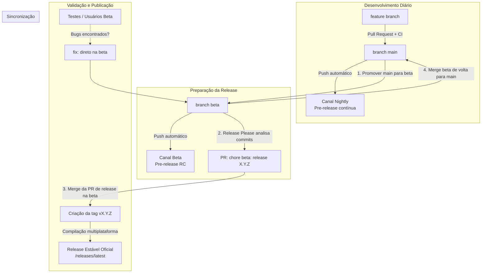

# Fluxo de Release, Branches e CI/CD — `diffv`

Este documento detalha o ciclo de vida de desenvolvimento, a estratégia de branches, os canais de distribuição (`nightly`, `beta`, `stable`), a automação de releases via **Google Release Please** e as proteções de branch configuradas no repositório.

---

## 1. Visão Geral da Estratégia de Branches

O projeto adota um modelo híbrido de **Trunk-Based com Branch de Estabilização (`beta`)**:

| Branch | Propósito | Canal Associado | Tipo de Release |
|---|---|---|---|
| **`main`** | Desenvolvimento contínuo (*bleeding edge*). Todas as novas features e refatorações entram aqui. | **`nightly`** | Rolling pre-release atualizada a cada commit |
| **`beta`** | Estabilização de Release Candidates (RC). Snapshot congelado para validação antes do lançamento oficial. | **`beta`** | Rolling pre-release atualizada a cada commit na `beta` |
| **Tags `v*`** | Lançamentos oficiais estáveis (produzidos pelo merge do Release Please na branch `beta`). | **`stable`** | Releases imutáveis no GitHub com binários compilados |

---

## 2. Diagrama do Ciclo de Vida



---

## 3. Canais de Distribuição & Atualização Automática

O cliente `diffv` possui um sistema de auto-atualização integrado (`src/update.rs`) com suporte a 3 canais:

1. **🌙 Nightly (`UpdateChannel::Nightly`):**
   - **Origem:** Gerado automaticamente a cada push na branch `main`.
   - **Identificador:** Tag flutuante `nightly` no GitHub Releases.
   - **Mecanismo:** Verifica o hash SHA-256 do binário instalado contra o binário publicado na tag `nightly`. Se houver diferença, atualiza atomicamente.

2. **🧪 Beta (`UpdateChannel::Beta`):**
   - **Origem:** Gerado automaticamente a cada push na branch `beta`.
   - **Identificador:** Tag flutuante `beta` no GitHub Releases.
   - **Mecanismo:** Verifica o hash SHA-256 contra a tag `beta` (com fallback para `nightly` caso ainda não exista release beta).

3. **🚀 Stable (`UpdateChannel::Stable` — Padrão):**
   - **Origem:** Publicado quando a PR do Release Please é mergeada na branch `beta`.
   - **Identificador:** Endpoint `/releases/latest` do GitHub (ignora rascunhos e pre-releases).
   - **Mecanismo:** Comparação semântica de versão (SemVer): atualiza apenas se `versão_remota > versão_local`.

---

## 4. Guia Passo a Passo do Mantenedor

### 4.1 No dia a dia (Desenvolvendo novas features)
1. Crie sua branch a partir da `main`:
   ```bash
   git checkout main
   git pull origin main
   git checkout -b feat/minha-feature
   ```
2. Faça seus commits seguindo o padrão de **Conventional Commits**:
   - `feat: ...` → Incrementa versão MINOR (ex: `0.4.0` → `0.5.0`).
   - `fix: ...` → Incrementa versão PATCH (ex: `0.4.0` → `0.4.1`).
   - `feat!: ...` ou `BREAKING CHANGE:` → Incrementa versão MAJOR.
3. Abra uma Pull Request apontando para a branch `main`.
4. O workflow de CI (`.github/workflows/ci.yml`) rodará os testes e o Clippy no Linux e macOS.
5. Após aprovação dos status checks, faça o merge na `main`. O canal **`nightly`** será atualizado imediatamente.

### 4.2 Promovendo para Beta (Criação de Release Candidate)
A promoção `main → beta` é automática até o ponto de merge:
1. A cada push na `main`, o workflow `.github/workflows/promote-to-beta.yml` abre (ou atualiza, se já existir) a Pull Request **`chore: promote main to beta`**, de `main` para `beta`. Ela **não** é mergeada automaticamente.
2. Quando um conjunto de funcionalidades estiver pronto para ser testado publicamente, cabe ao mantenedor revisar e fazer o merge dessa PR.

   *Alternativa manual:* se preferir (ou se o workflow não estiver disponível), sincronize a `beta` com a `main` diretamente:
   ```bash
   git checkout beta
   git pull origin beta
   git merge main
   git push origin beta
   ```
3. Ao receber o push na `beta`, a esteira do GitHub Actions:
   - Compila e atualiza os binários da pre-release no canal **`beta`**.
   - Executa o **Release Please**, que cria ou atualiza uma Pull Request na branch `beta` (ex: `chore(beta): release 0.5.0`) com o `CHANGELOG.md` e a versão do `Cargo.toml` já calculados.

### 4.3 Corrigindo bugs durante a fase Beta
Se você ou outros usuários encontrarem bugs durante o uso do canal Beta:
1. Aplique a correção diretamente na branch `beta` (ou via PR para `beta`):
   ```bash
   git checkout beta
   # faça as alterações
   git commit -m "fix: resolve bug no drawer"
   git push origin beta
   ```
2. O Release Please atualizará automaticamente a PR de release com o novo fix adicionado ao changelog.
3. **Importante:** Enquanto isso, a `main` pode continuar recebendo novos `feat:` para a versão seguinte sem interferir na release atual!

### 4.4 Lançando a Release Estável Oficial
Após o período de testes no beta:
1. Vá até a Pull Request aberta pelo Release Please na branch `beta` (ex: `chore(beta): release 0.5.0`).
2. Revise o changelog gerado e faça o **Merge**.
3. O Release Please criará automaticamente a tag imutável `v0.5.0` no repositório.
4. O workflow `.github/workflows/release.yml` detectará a tag e:
   - Compilará os binários otimizados para 4 targets:
     - `aarch64-apple-darwin` (macOS Apple Silicon)
     - `x86_64-apple-darwin` (macOS Intel)
     - `x86_64-unknown-linux-gnu` (Linux x86_64)
     - `aarch64-unknown-linux-gnu` (Linux ARM64)
   - Gerará os arquivos de checksum SHA-256 (`.sha256`).
   - Anexará todos os binários à Release estável no GitHub.

### 4.5 Sincronizando de volta para a `main`
Após o lançamento da release:
1. Faça o merge da `beta` de volta para a `main` para sincronizar o `CHANGELOG.md` e a nova versão base do `Cargo.toml`:
   ```bash
   git checkout main
   git pull origin main
   git merge beta
   git push origin main
   ```
2. A `main` agora sabe que a versão oficial é `0.5.0` e os próximos commits contarão a partir dela.

---

## 5. Workflows de CI/CD (GitHub Actions)

O repositório possui três workflows automatizados em `.github/workflows/`:

| Arquivo | Gatilhos | Responsabilidade |
|---|---|---|
| **`ci.yml`** | `pull_request` em `main`/`beta`; `push` em `beta` | Roda `cargo test` no Linux e macOS e `cargo clippy --all-targets -- -D warnings`. Emite o status check unificado `CI Passed`. |
| **`release.yml`** | `push` em `main`, `push` em `beta`, tags `v*` | Compila os 4 targets. Na `main`, publica `nightly`. Na `beta`, publica `beta`. Em tags, publica a release `stable` com os binários anexados. |

**Publicação rolante (`nightly` / `beta`):** a cada push, o `release.yml` move a tag flutuante (`nightly` ou `beta`) para o commit do push via API, e cria ou atualiza a release *in place* (envia os 8 assets com `--clobber` antes de remover qualquer asset obsoleto, e atualiza título/notas). Se a data de criação da release (que o GitHub deriva do commit da tag e que ordena a página de Releases) ficar anterior ao commit, a release é recriada mantendo a tag. Ao final, o passo confere tag, 8 assets e data. Só "ainda não existe" é tolerado; qualquer outro erro deixa o run vermelho. Um re-run de um commit antigo não move o canal para trás (avisa e sai se a branch já avançou). O caminho estável (`v*`) não é afetado.
| **`release-please.yml`** | `push` em `beta` | Executa o Google Release Please na branch `beta`. Mantém a PR de release atualizada e dispara a esteira de build estável no merge. |

---

## 6. Proteções de Branch (GitHub Rulesets)

As seguintes regras estão ativas via GitHub Repository Rulesets:

* **Branch `main`:**
  * Bloqueio contra deleção de branch.
  * Bloqueio contra `git push --force`.
  * Exigência de Pull Request para merges (com resolução de comentários obrigatória).
  * Exigência do check **`CI Passed`** verde antes do merge.
  * Papel de Administrador configurado com permissão de bypass para emergências.

* **Branch `beta`:**
  * Bloqueio contra deleção de branch.
  * Bloqueio contra `git push --force`.
  * Exigência do check **`CI Passed`** verde antes do merge.
  * Papel de Administrador configurado com permissão de bypass.
